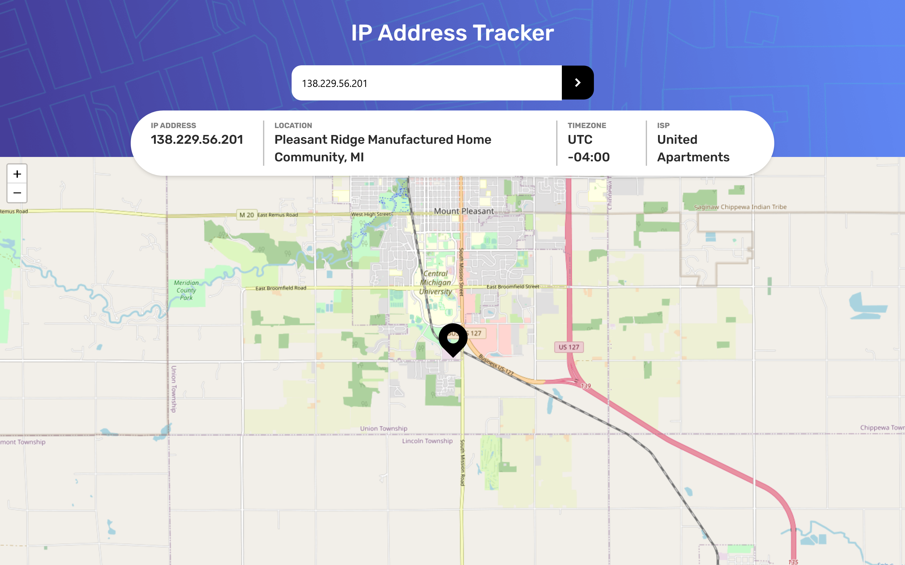
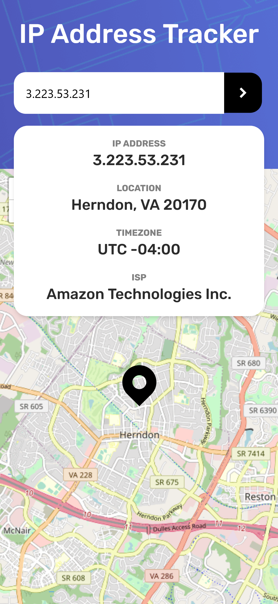

# Frontend Mentor - IP address tracker solution

This is a solution to the [IP address tracker challenge on Frontend Mentor](https://www.frontendmentor.io/challenges/ip-address-tracker-I8-0yYAH0). Frontend Mentor challenges help you improve your coding skills by building realistic projects. 

## Table of contents

- [Overview](#overview)
  - [The challenge](#the-challenge)
  - [Screenshot](#screenshot)
  - [Links](#links)
- [My process](#my-process)
  - [Built with](#built-with)
  - [What I learned](#what-i-learned)
  - [Continued development](#continued-development)
  - [Useful resources](#useful-resources)
- [Author](#author)

## Overview

### The challenge

Users should be able to:

- View the optimal layout for each page depending on their device's screen size
- See hover states for all interactive elements on the page
- See their own IP address on the map on the initial page load
- Search for any IP addresses or domains and see the key information and location

### Screenshots





## My process

- Research the APIs I would be using.
  * [IP Geolocation API](https://geo.ipify.org/)
  * [LeafletJS](https://leafletjs.com/)

### Built with

- Mobile-first workflow
- [Next.js](https://nextjs.org/)
- Tailwind CSS
- Typescript
- LeafletJS / React Leaflet
- Axios


### What I learned

Creating my own Data types to parse the json response:
```ts
  type Data = {
    "ip"?: string,
    "location"?: {
      "country" ?: string,
      "region" ?: string,
      "city" ?: string,
      "lat" ?: number,
      "lng" ?: number,
      "postalCode" ?: string,
      "timezone" ?: string,
    },
    "isp"?: string,
    'error': Error | undefined,
  };
```


### Continued development

I'm getting comfortable with using Typescript using NextJS and I can hopefully apply it to bigger projects soon such as my personal webiste


### Useful resources

- [React Leaflet]([https://www.example.com](https://react-leaflet.js.org/)) - This helped me immensely in implement the map in React
- [NextJS Documentation: API Routes](https://nextjs.org/docs/api-routes/introduction)) - This article was great in introducing API Routes within my own application to send requests to the Geolocation API. It also helped me figure out how to enable CORS on API routes.

## Author

- Website - [Bakhtiar Reza]([https://www.your-site.com](https://bakhtiar-reza-site.vercel.app/))
- Frontend Mentor - [@Dradeon](https://www.frontendmentor.io/profile/Dradeon)

